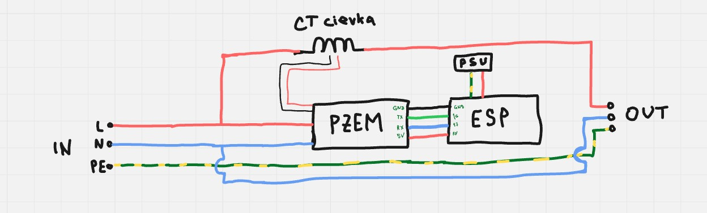
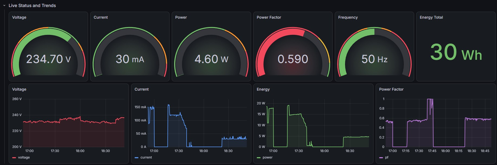
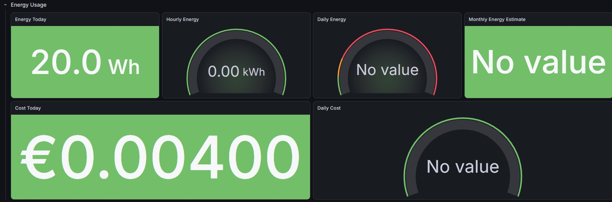
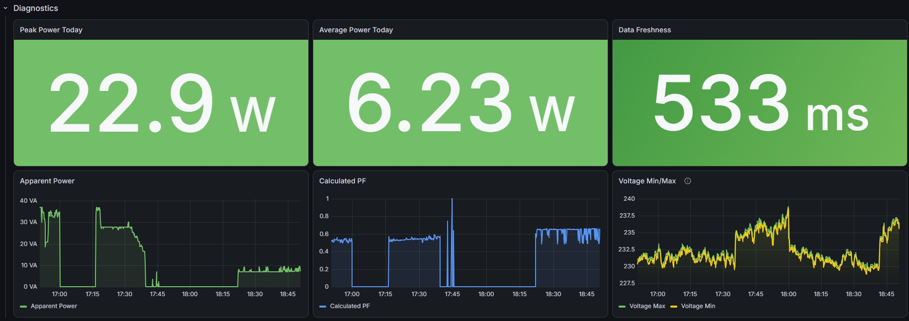

# Smart Energy Meter

ESP32 firmware for a WiFi-connected energy monitor built around the PZEM-004T v3.0 meter module. The device reads live electrical values, prints them to the serial monitor, and sends valid measurements to InfluxDB for Grafana dashboards.

> Warning: this project involves mains voltage. Use a proper insulated enclosure, fusing, strain relief, and safe wiring practices. Work on mains circuits only if you are qualified to do so.

## What It Measures

- Voltage
- Current
- Active power
- Total energy
- Frequency
- Power factor

## Hardware

- ESP32 development board
- PZEM-004T v3.0 energy meter module
- Current transformer supplied with the PZEM module
- Enclosure or the included 3D-printable box files
- WiFi network with access to your InfluxDB instance

## Wiring

The repository includes a wiring reference for the ESP32 and PZEM module:



Also see the vendor documents in [`docs/datasheets`](docs/datasheets):

- [`PZEM-004T-V3.0-Datasheet-User-Manual.pdf`](docs/datasheets/PZEM-004T-V3.0-Datasheet-User-Manual.pdf)
- [`esp-dev-kits-en-master-esp32.pdf`](docs/datasheets/esp-dev-kits-en-master-esp32.pdf)

## Firmware Flow

1. Connect to WiFi.
2. Initialize the PZEM sensor on `Serial2`.
3. Synchronize time for InfluxDB writes.
4. Read meter values at the configured interval.
5. Validate all meter fields.
6. Print readings to the serial monitor.
7. Write valid readings to InfluxDB as the `pzem_data` measurement.

InfluxDB points are tagged with:

- `device=esp32`
- `sensor=pzem004t`

Fields written to InfluxDB:

- `voltage`
- `current`
- `power`
- `energy`
- `frequency`
- `pf`

## Software Stack

- ESP32 Arduino framework
- PlatformIO
- [`mandulaj/PZEM-004T-v30`](https://registry.platformio.org/libraries/mandulaj/PZEM-004T-v30)
- [`tobiasschuerg/ESP8266 Influxdb`](https://registry.platformio.org/libraries/tobiasschuerg/ESP8266%20Influxdb)
- InfluxDB
- Grafana

## Configuration

Create your local configuration file from the example:

```text
include/config.h
```

Use [`include/config.example.h`](include/config.example.h) as the template and fill in:

- WiFi SSID and password
- PZEM RX and TX GPIO pins
- Timezone string
- Data read interval
- InfluxDB URL, organization, bucket, and token

Example values:

```cpp
#define WIFI_SSID "your_wifi_name"
#define WIFI_PASSWORD "your_wifi_password"

#define PZEM_RX_PIN 16
#define PZEM_TX_PIN 17
#define TZ_INFO "CET-1CEST,M3.5.0,M10.5.0/3"
#define DATA_READ_INTERVAL 5000

#define INFLUXDB_URL "https://your-influxdb-url"
#define INFLUXDB_ORG "your_org"
#define INFLUXDB_BUCKET "your_bucket"
#define INFLUXDB_TOKEN "your_token"
```

Do not commit real WiFi credentials or InfluxDB tokens.

## Build and Upload

Install PlatformIO, connect the ESP32, then run:

```bash
pio run
pio run --target upload
pio device monitor
```

The serial monitor uses `115200` baud.

## Grafana

The project includes a Grafana dashboard export:

[`docs/grafana/dashboard-1783107967194.json`](docs/grafana/dashboard-1783107967194.json)

Dashboard screenshots:







## 3D-Printable Enclosure

The printable box files are available in [`docs/3dprinting`](docs/3dprinting):

- [`PZEM BOX.stl`](docs/3dprinting/PZEM%20BOX.stl)
- [`PZEM BOX.svg`](docs/3dprinting/PZEM%20BOX.svg)

Preview:


## Repository Layout

```text
include/
  config.example.h       Example local configuration
  influx_writer.h        InfluxDB writer interface
  pzem_reader.h          Meter data structure and reader interface
  wifi_manager.h         WiFi connection helpers

src/
  main.cpp               Firmware entry point
  influx_writer.cpp      InfluxDB setup and point writes
  pzem_reader.cpp        PZEM initialization and reads
  wifi_manager.cpp       WiFi connect/reconnect logic

docs/
  datasheets/            Wiring image and hardware PDFs
  grafana/               Dashboard export and screenshots
  3dprinting/            Enclosure STL/SVG files
```

## Project Status

The core firmware path is implemented:

- WiFi connection and reconnect handling
- PZEM reading and validation
- Serial logging
- InfluxDB writes
- Grafana dashboard assets

Next useful improvements would be OTA updates, stronger configuration validation, and documented calibration/reset procedures for the meter module.
